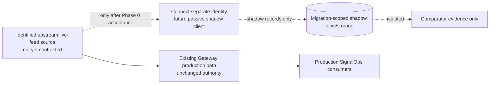
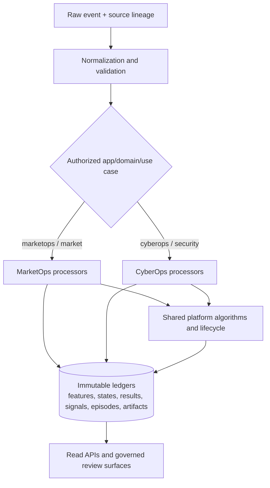
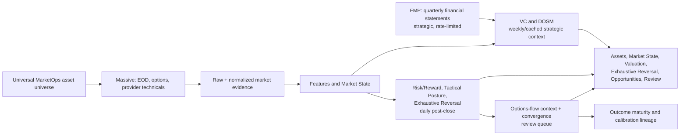
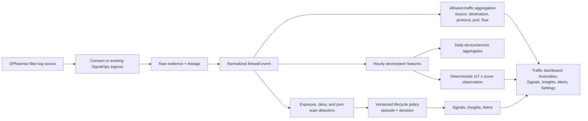
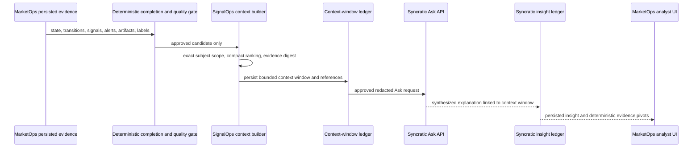

# SignalOps, Connect, Domain, and Syncratic Architecture

**Status:** implemented architecture with explicitly marked migration targets  
**Version:** 1.0  
**Audience:** platform engineers, domain engineers, operators, security reviewers, and analysts

## Purpose

SignalOps is the durable evidence and deterministic decision-support platform. Syncratic Connect is its ingress subsystem: it authenticates and resolves producers, preserves immutable ingress evidence, maps protocol data to a declared dataset, and publishes a versioned SignalOps raw-event contract. SignalOps owns normalization, domain processing, algorithms, lifecycle policy, review surfaces, and evidence-backed APIs.

MarketOps and CyberOps are specialized SignalOps domains. They share platform primitives; neither owns an independent ingestion, broker, lineage, or algorithm-control plane. Syncratic is a bounded explainability interface for the implemented MarketOps EOD workflow. It does not replace SignalOps ledgers or become a general MarketOps data lake.

This document separates the **deployed production path** from the **planned Connect migration path**. A planned or shadow path is not authorized to publish to production domain consumers.

## System context and ownership

```mermaid
flowchart LR
    source[External sources and providers\nfirewall, market-data providers, operator input]
    connect[Syncratic Connect\nidentity, protocol decode, mapping, immutable ingress, outbox]
    gateway[SignalOps Gateway\nexisting/direct ingress and APIs]
    broker[(Redpanda / Kafka\ndurable distribution)]
    raw[(Raw-event ledger\nidempotency and provenance)]
    normalized[(Normalized-event ledger\nvalidated canonical records)]
    domains[SignalOps domain processors\nMarketOps and CyberOps]
    results[(Features, states, algorithm results,\nsignals, lifecycle, artifacts, outcomes)]
    api[SignalOps API and web UI\nRBAC-scoped analyst and operator views]
    syncratic[Syncratic user facade\nbounded Ask synthesis for MarketOps]

    source -->|authenticated ingress| connect
    source -->|existing/direct source path| gateway
    connect -->|RawSignalEvent v1\nmetadata.connect lineage| broker
    gateway -->|raw event| raw
    broker -->|accepted/raw consumer| raw
    raw --> normalized --> domains --> results --> api
    results -->|subject-pure, bounded MarketOps context| syncratic
    syncratic -->|persisted explanation + evidence references| results
```



| System | Owns | Does not own |
|---|---|---|
| Connect | Source connectivity, ingress authentication, trusted tenant/producer resolution, protocol decoding, mapping, immutable ingress evidence, outbox delivery, replay of Connect evidence | Domain features, states, Signals, Insights, Alerts, algorithms, or direct writes to SignalOps storage |
| SignalOps | Raw acceptance, normalization, durable domain evidence, feature/state materialization, algorithm execution, lifecycle policy, APIs, RBAC, storage governance | A Connect control plane, Connect ingress-evidence store, or unapproved source credentials |
| MarketOps | Deterministic market research processing and analyst workflows | Provider-facing browser calls, trading, order placement, or portfolio action |
| CyberOps | Firewall/IoT evidence processing, configured exposure context, detection, and lifecycle workflows | Firewall control, automated remediation, or threat attribution |
| Syncratic | Approved bounded natural-language synthesis of a SignalOps-built MarketOps context | Source ingestion, unbounded MarketOps corpus storage, deterministic record mutation, or direct domain action |

`tenant_id` is the cross-system authorization and data-isolation boundary. It is not an application name. `app_id`, `domain`, and `use_case` route the record into an authorized SignalOps workflow.

## Connect-to-SignalOps ingestion and lineage

### Deployed contract

Connect publishes a schema-validated `RawSignalEvent v1` to `signalops.<environment>.raw.v1`. It adds Connect provenance under `metadata.connect`; it does not replace or fork SignalOps primitive contracts.

```mermaid
sequenceDiagram
    participant P as Producer / source
    participant C as Connect
    participant CL as Connect ledger + outbox
    participant B as Redpanda
    participant S as SignalOps raw acceptance
    participant R as Raw ledger + idempotency
    participant N as Normalizer
    participant NL as Normalized ledger

    P->>C: authenticated payload or frame
    C->>C: resolve trusted tenant, producer, connector, channel
    C->>CL: persist ingress, mapping, payload hash, processing result
    CL->>B: publish RawSignalEvent v1 through durable outbox
    B->>S: at-least-once delivery
    S->>S: schema and semantic validation; classify idempotency
    S->>R: persist accepted raw evidence or durable integrity/failure evidence
    R->>N: accepted raw record
    N->>NL: canonical normalized record and validation outcome
```

| Time | Meaning |
|---|---|
| `occurred_at` / `effective_time` | Source event time when supplied and validated |
| `observed_at` / `observation_time` | Source observation or ingress-receipt time according to the contract |
| `processing_time` | Time a Connect or SignalOps stage processed the record |
| durable row creation time | Persistence timing; never a substitute for source event time |

The immutable lineage chain is queryable by stable IDs:

```text
SignalOps raw event
  <- Connect delivery and outbox record
  <- Connect processing result and mapping result
  <- protocol decode
  <- immutable ingress event and payload hash/reference
  <- authenticated channel and resolved producer
  <- immutable connector version and tenant-routing decision
```

### Source migration status

Connect Phase 1 webhook/ledger/outbox delivery is an accepted ingress architecture. Existing direct SignalOps source paths remain valid and may remain the production authority until a source-specific migration is explicitly accepted.

The proposed Gateway WebSocket migration is **blocked externally**. No concrete upstream source contract, source identity, protocol fixture, comparator contract, or four-party acceptance package is accepted. The browser-facing SignalOps dashboard SSE endpoint is not an upstream WebSocket source and must not be treated as one.



Before this migration can start, the source owner, SignalOps, Connect, and Platform Security must accept a source-specific contract with source identity, endpoint/TLS/authentication, subscription/continuity semantics, capacity limits, Gateway comparison evidence, shadow ACL isolation, and numeric parity thresholds. Connect uses a distinct source identity and must never advance, take over, or reuse the Gateway cursor/session. Shadow records must not reach production normalizers, detectors, processors, Signals, Insights, Alerts, or browser consumers.

## Shared SignalOps processing plane



| Boundary | Required behavior |
|---|---|
| Data quality | Missing, stale, partial, or invalid input is explicit; it is never coerced to zero or an optimistic default |
| Algorithm execution | Versioned requests and immutable results; algorithms do not directly mutate production Signal/Alert/Insight state |
| Lifecycle | Signals are durable facts; policy decides whether an Insight or Alert exists and records reason/version |
| UI/API | Browser views read persisted APIs/caches; viewing does not acquire provider data or manufacture evidence |
| RBAC | Tenant scope and domain access are checked before reads/mutations; configuration writes require authorized roles |

## MarketOps domain flow

MarketOps is deterministic market surveillance and analyst research support. Its post-close evidence path is independent from its intraday presentation cache.



1. The governed asset universe plans post-close acquisition. Massive completed-session evidence is persisted and normalized before feature/state work proceeds.
2. Options capture produces coverage, quality, selected chain rows, and derived distributions. Put/call evidence is descriptive corroboration, not trader intent.
3. Market State persists point-in-time features, quality, state, transitions, and evidence references.
4. VC and DOSM use retained financial snapshots and canonical market data for slow-moving strategic context. Routine calculation reuses snapshots; FMP refreshes are explicit and rate-controlled.
5. Risk/Reward, Tactical Market Posture, and Exhaustive Reversal produce daily technical/reversal evidence from a completed session.
6. The convergence layer requires independent same-session evidence before creating a selective review item; material disagreement becomes mixed-conviction review. An empty queue is valid.
7. Outcome observations mature at 1, 5, 10, and 20 trading sessions for later calibration. They are not a performance claim.

The intraday quote cache is an analyst-display path. It may show delayed/latest session condition, but does not substitute for post-close normalization or feed research outcome calculations.

## CyberOps domain flow

CyberOps applies the shared raw-to-normalized platform flow to firewall evidence. It prioritizes allowed-traffic understanding and separates durable detection evidence from interrupting operator work.



- The live dashboard reads the primary normalized ledger and shows received, allowed, and unparsed volume, trends, entities, services, and flows.
- Tenant-owned internal CIDRs define the internal-device population. The hourly anomaly worker evaluates a completed hour, uses a seven-day lookback with at least 24 active baseline hours, and examines allowed-log count and distinct-peer count. Absolute z-score at or above 3σ is a review-only anomaly observation.
- Approved public services are explicit destination IP/protocol/port configuration. They provide interpretation context; they do not change firewall policy.
- A public-source port scan reaches policy threshold at ten distinct denied destination ports from one source to one destination in five minutes. Repeated packets to one port do not count as distinct ports.
- The CyberOps lifecycle seed is currently shadow mode for the local environment: it persists Signals, grouped episodes, and immutable projected decisions, but does not create new policy-driven Insights or Alerts. External denies remain evidence-only by default.

CyberOps does not automatically block traffic, alter firewall configuration, create tickets, page responders, perform remediation, or assert that an allowed/denied packet proves safety or maliciousness.

## Syncratic explainability interface

Syncratic is currently used only for a bounded **MarketOps EOD explainability** workflow. SignalOps controls the evidence boundary and stores the resulting insight with deterministic context identity and evidence references.



The context builder is deterministic and subject-pure. For the current symbol strategy, it excludes evidence for other known tickers, limits the evidence window and item counts, ranks records deterministically, and retains omitted/included counts. It does not send an unbounded raw-data dump to Syncratic.

Syncratic Ask enriches an approved context; it cannot overwrite a SignalOps Market State, algorithm result, Signal, Alert, hypothesis, recommendation, or lifecycle decision. Search is not the current enrichment path because SignalOps has not established a dedicated Syncratic MarketOps corpus/retrieval policy. SignalOps does not bulk-ingest MarketOps data into Syncratic, write graph state, or use Syncratic to take action. CyberOps has no implemented Syncratic synthesis workflow.

## Storage, retention, and observability

| Data class | Retention baseline | Purpose after raw expiry |
|---|---:|---|
| MarketOps raw provider payloads | 30 days | Raw/replay grace period |
| MarketOps EOD/features/states/scores/outcomes | 12 months | Algorithm integrity, analyst trace, and calibration lineage |
| MarketOps detailed option chain | 92 days | Short-lived detail; distributions/results remain 12 months |
| MarketOps financial facts/snapshots | 4 years | Strategic valuation evidence and provenance |
| CyberOps raw/normalized firewall detail and hourly features | 30 days | Recent operational investigation and feature materialization |
| CyberOps daily aggregates, anomaly/lifecycle evidence | 12 months | Learning/evidence continuity after high-resolution expiry |

Retention governance runs daily at 02:30 ET in dry-run mode. It records candidates and policy results; deletion requires an approved policy-mode change and explicit execution. Compact receipts preserve identity, hash, source/dataset, time, parser/version, and quality metadata before referenced high-resolution CyberOps evidence becomes eligible for expiry.

Administration exposes schedules, health, algorithm definitions, storage utilization, and retention-governance results. A degraded source, parser, normalizer, worker, or scheduler is visible as an operational condition; it is not a domain conclusion.

## Safety invariants

1. No Connect service directly writes SignalOps databases or creates domain records.
2. No domain processor treats unpersisted, provider-shaped data as canonical ordinary input.
3. No source-migration shadow output may reach production SignalOps consumers.
4. No browser page load performs source acquisition or creates research/security evidence.
5. No Syncratic response overwrites deterministic evidence or causes automated action.
6. No MarketOps artifact is an investment recommendation, order, or portfolio action.
7. No CyberOps artifact is an automatic firewall action, threat attribution, or remediation decision.

## Related documents

- [SignalOps architecture and data flow](signalops_architecture_data_flow.md): platform primitives and detailed MarketOps operating flow.
- [Connect ingress integration](../connect/signalops-connect-ingress-integration-v1.md): SignalOps-side Connect contract and accepted/raw routing requirements.
- [Connect data flow and lineage](../../../connect/docs/architecture/data-flow-and-lineage.md): Connect-owned immutable ingress lineage.
- [Connect system context](../../../connect/docs/architecture/system-context.md): ownership boundaries and Phase 1 topology.
- [Syncratic user API boundary](../use_cases/marketops/daily_market_surveillance/architecture/syncratic_user_api_boundary.md): external Syncratic facade contract.
- [Syncratic context windows](../use_cases/marketops/daily_market_surveillance/architecture/syncratic_context_windows.md): bounded evidence/purity rules.
- [Retention governance](../support/retention-governance.md): authoritative retention policy and enforcement guardrails.
